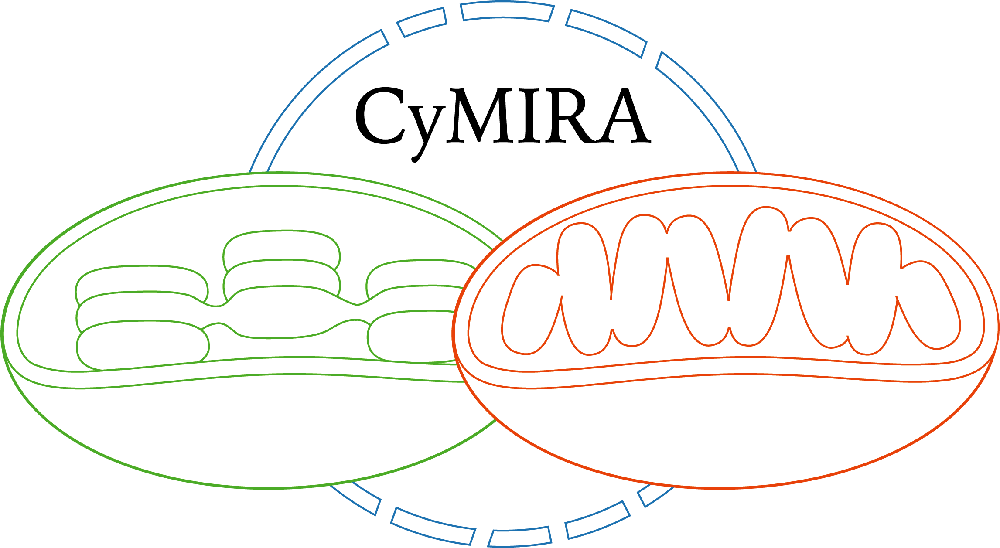

# CyMIRA
The Cytonuclear Molecular Interactions Reference for Arabidopsis

CyMIRA is a detailed classification of genes involved in cytonuclear interactions in Arabidopsis thaliana. CyMIRA integrates existing subcellular localization, cytonuclear pathways/complexes, and structural data to formulate a consistent annotation of cytonuclear genes for use in genomic studies of cytonuclear coevolution in plants.

The current version of the dataset is available for download from this repository as a tab-delimited text file and an Excel spreadsheet. A queryable web interface is also available at http://cymira.colostate.edu/.

To cite CyMIRA or learn details about its development, please see our [paper in Genome Biology and Evolution](https://academic.oup.com/gbe/article/11/8/2194/5529674):
Forsythe ES, Sharbrough J, Havird JC, Warren JM, Sloan DB. 2019. CyMIRA: The Cytonuclear Molecular Interactions Reference for Arabidopsis. Genome Biology and Evolution. 11: 2194–2202.
